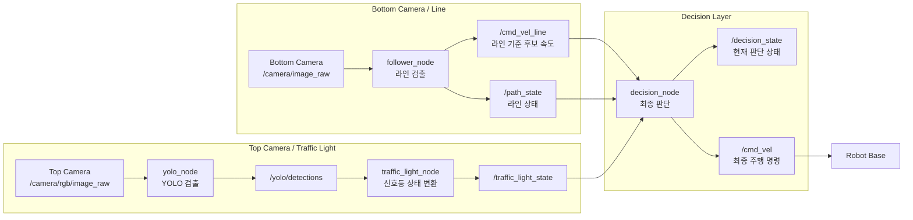
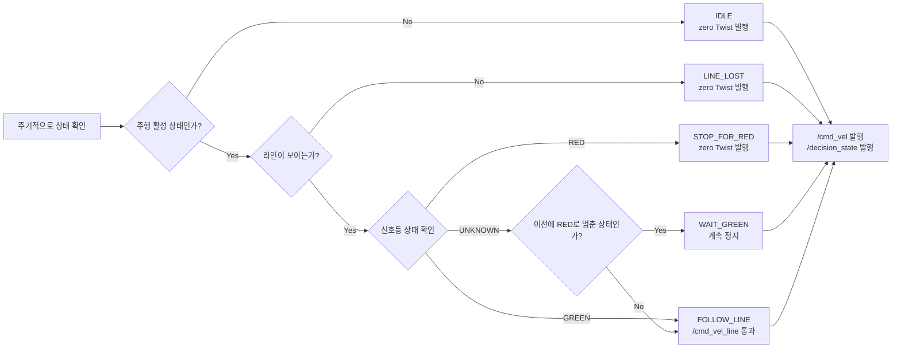

# ROS 구조 구체화

## 목적

이 레포의 1차 목적은 카메라 이미지 입력부터 최종 `/cmd_vel` 출력까지의 ROS2 파이프라인을 정리하고 구현하는 것이다.

그 뒤의 lino hardware, motor driver, 실제 로봇 하드웨어 제어 계층은 이 레포의 1차 범위에서 제외한다.

하드웨어까지 연결하는 작업은 이후 다른 브랜치에서 합쳐서 진행한다.

## 앞으로 방향성

일단 통합적으로 어떤 스테이트를 볼 것인지, 그리고 어떤 흐름으로 이동시킬 것인지 재확인한다.

목표는 전반적인 파이프라인 구조를 먼저 확정하는 것이다.

1차 구조에서는 좌회전과 우회전에 대한 판단은 제외한다.

따라서 YOLO로 판단하는 것은 우선 신호등만으로 제한한다.

우선 목표는 아래 정도로 생각한다.

```text
라인을 따라 주행한다.
빨간불이면 멈춘다.
초록불이면 다시 간다.
라인을 잃으면 정지하거나 복구 대기한다.
최종 /cmd_vel은 decision_node 하나만 발행한다.
```

## 구조

### 1차 파이프라인

현재 구조는 이렇다.

```bash
/camera/image_raw
    -> follower_node
        -> /cmd_vel

/camera/rgb/image_raw
    -> /yolo/yolo_node
        -> /yolo/detections
```

목표 구조는 아래처럼 잡는다.

```bash
Bottom Camera
    -> follower_node
        -> /cmd_vel_line
        -> /path_state

Top Camera
    -> yolo_node
        -> /yolo/detections
    -> traffic_light_node
        -> /traffic_light_state

decision_node
    <- /cmd_vel_line
    <- /path_state
    <- /traffic_light_state

    -> /cmd_vel
    -> /decision_state
```

핵심은 `follower_node`가 더 이상 최종 `/cmd_vel`을 직접 내지 않는 것이다.

```text
현재:
follower_node -> /cmd_vel

변경:
follower_node -> /cmd_vel_line
decision_node -> /cmd_vel
```

### 패키지 역할 재정리

```text
follower
    라인 검출
    라인 기준 주행 후보 속도 생성
    /cmd_vel_line 발행
    /path_state 발행

yolo_msgs
    YOLO DetectionArray / Detection 메시지 정의

yolo_ros
    카메라 이미지에서 YOLO detection 수행
    /yolo/detections 발행

yolo_bringup
    yolo_node, debug_node 실행용 launch 관리

traffic_light_node
    /yolo/detections를 받아 신호등 상태로 변환
    /traffic_light_state 발행

decision_node
    라인 추종 명령과 신호등 상태를 종합
    최종 /cmd_vel 발행
```

### 전체 파이프라인 Flow Chart



### decision_node 내부 판단 Flow Chart



## 노드별 I/O 정리

각 노드의 역할, 기존/신규 입력, 출력 등을 정리한다.

### 1. `follower_node`

역할:

```text
Bottom Camera 영상에서 라인을 검출하고,
라인 기준 주행 후보 속도와 라인 상태를 만든다.
```

기존 입력:

```text
/camera/image_raw
  type: sensor_msgs/msg/Image
  설명: 라인 검출용 하단 카메라 이미지
```

기존 출력:

```text
/cmd_vel
  type: geometry_msgs/msg/Twist
  설명: 최종 주행 명령
  상태: 변경 예정
```

변경 후 출력:

```text
/cmd_vel_line
  type: geometry_msgs/msg/Twist
  설명: 라인 추종 기준 후보 속도
  상태: 새로 추가
```

```text
/path_state
  type: 신규 메시지 필요
  설명: 라인을 보고 있는지, 라인 중심 오차가 얼마인지 알려주는 상태
  상태: 새로 추가
```

`/path_state`에 들어갈 내용 예시:

```text
line_visible
line_error_x
line_confidence
lost_duration
```

서비스 기존:

```text
/start_follower
/stop_follower
  type: std_srvs/srv/Empty
  상태: 추후 decision_node 쪽으로 옮기는 것이 좋음
```

정리:

```text
기존 유지:
  /camera/image_raw 입력

기존 변경:
  /cmd_vel 출력 제거 또는 중단

신규 추가:
  /cmd_vel_line 출력
  /path_state 출력
```

### 2. `yolo_node`

역할:

```text
Top Camera 영상에서 YOLO 객체 검출을 수행한다.
```

기존 입력:

```text
/camera/rgb/image_raw
  내부 토픽명: image_raw
  type: sensor_msgs/msg/Image
  설명: YOLO 추론용 상단 카메라 이미지
```

기존 출력:

```text
/yolo/detections
  내부 토픽명: detections
  type: yolo_msgs/msg/DetectionArray
  설명: YOLO 검출 결과
```

기존 서비스:

```text
/yolo/enable
  type: std_srvs/srv/SetBool
  설명: YOLO 추론 활성화/비활성화
```

```text
/yolo/set_classes
  type: yolo_msgs/srv/SetClasses
  설명: YOLOWorld/YOLOE용 클래스 설정
```

정리:

```text
기존 유지:
  /camera/rgb/image_raw 입력
  /yolo/detections 출력
  /yolo/enable 서비스

새로 추가 없음
```

### 3. `traffic_light_node`

역할:

```text
YOLO detection 결과를 받아 신호등 상태로 변환한다.
```

상태:

```text
신규 추가 노드
```

입력:

```text
/yolo/detections
  type: yolo_msgs/msg/DetectionArray
  설명: YOLO 검출 결과
```

출력:

```text
/traffic_light_state
  type: 신규 메시지 필요
  설명: 현재 신호등 상태
```

`/traffic_light_state`에 들어갈 내용 예시:

```text
state: UNKNOWN / RED / GREEN
confidence
detected_class_name
stamp
```

정리:

```text
신규 추가:
  traffic_light_node
  /yolo/detections 입력
  /traffic_light_state 출력
```

### 4. `decision_node`

역할:

```text
라인 추종 후보 속도, 라인 상태, 신호등 상태를 종합해서
최종 /cmd_vel을 발행한다.
```

상태:

```text
신규 추가 노드
```

입력:

```text
/cmd_vel_line
  type: geometry_msgs/msg/Twist
  설명: follower_node가 만든 라인 추종 후보 속도
```

```text
/path_state
  type: 신규 메시지 필요
  설명: 라인 인식 상태
```

```text
/traffic_light_state
  type: 신규 메시지 필요
  설명: 신호등 상태
```

출력:

```text
/cmd_vel
  type: geometry_msgs/msg/Twist
  설명: 최종 주행 명령
```

```text
/decision_state
  type: 신규 메시지 필요
  설명: 현재 decision_node의 판단 상태
```

`/decision_state`에 들어갈 내용 예시:

```text
state: IDLE / FOLLOW_LINE / STOP_FOR_RED / WAIT_GREEN / LINE_LOST / FINAL_STOP
reason
motion_enabled
```

서비스 후보:

```text
/start_driving
/stop_driving
  type: std_srvs/srv/Empty 또는 SetBool
  설명: 전체 주행 시작/정지
  상태: 새로 추가 고려
```

정리:

```text
신규 추가:
  decision_node
  /cmd_vel_line 입력
  /path_state 입력
  /traffic_light_state 입력
  /cmd_vel 출력
  /decision_state 출력
```

### 5. `debug_node`

역할:

```text
YOLO detection 결과를 이미지 위에 그려서 확인한다.
```

기존 입력:

```text
/camera/rgb/image_raw
  type: sensor_msgs/msg/Image
```

```text
/yolo/detections
  type: yolo_msgs/msg/DetectionArray
```

기존 출력:

```text
/yolo/dbg_image
  type: sensor_msgs/msg/Image
```

기존에는 3D marker 출력도 있다.

```text
/yolo/dgb_bb_markers
/yolo/dgb_kp_markers
```

1차 구조에서는 3D detection을 다루지 않으므로 이 출력은 제거해도 된다.

정리:

```text
기존 유지:
  /yolo/dbg_image

정리 대상:
  tracking 기반 입력
  3D marker 관련 출력
```

## 전체 요약

```text
기존 유지:
  follower_node
  yolo_node
  debug_node
  yolo_msgs
  yolo_bringup

기존 변경:
  follower_node
    /cmd_vel 직접 발행 중단
    /cmd_vel_line 발행으로 변경

새로 추가:
  /path_state
  traffic_light_node
  /traffic_light_state
  decision_node
  /decision_state

제거 또는 비활성:
  tracking_node
  detect_3d_node
  /yolo/tracking
  /yolo/detections_3d
```

## 1차 범위

결론적으로 이 레포에서 우선 다루고 싶은 것은 이미지 노드부터 `/cmd_vel` 출력까지이다.

```text
camera image
-> line detection
-> YOLO traffic light detection
-> traffic light state
-> decision state
-> /cmd_vel
```

그 뒤의 lino hardware, base controller, motor driver, 실제 actuator 제어는 현재 범위에서 제외한다.

이후 하드웨어 제어 브랜치와 합치면서 실제 로봇에서 동작하는 형태로 확장한다.
